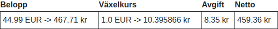

# Findus Web App

## Verifikat 
Skapar och Verifierar Fortnox faktureringar av beställning hämtad från
WooCommerce.

Proforma faktura:

-   Får VAT för Standard eller Reducerad(livsmedel) skatt från WooCommerce.  
    
    
-   Hämtar Riksbankens Växelkurs för EUR-SEK i dagsavslut för
    betalningsdatumet.  
      
-   När betalningen har gjorts med Stripe så tar vi deras växelkurs som
    är kalkylerad vid betalningen.  
    
-   Automatisk hantering av Stripe/PayPal avgift  
    
    

Faktura som speglar ordern från WooCommerce:

-   Kundinformation, Adress, Email, m.m.
-   Produkt information i ordern, SKU & Pris
